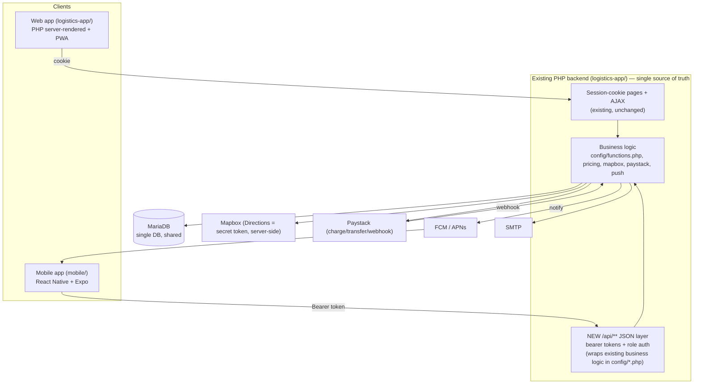

# Aike Mobile — Architecture Recommendation

## Recommendation: React Native + Expo (TypeScript), managed workflow with config plugins

Chosen after weighing the existing stack and the spec's constraints (low/mid-range Android,
maps, background location, push, payments, offline, small team, long-term maintenance cost).

### Why React Native + Expo (not Flutter / native / hybrid webview)

| Criterion | RN + Expo | Flutter | Native (2 codebases) | Hybrid WebView |
|---|---|---|---|---|
| One codebase → Android + iOS | ✅ | ✅ | ❌ (2×) | ✅ |
| Team skill fit (repo is JS/PHP, no Dart/Kotlin/Swift) | ✅ strong | ◐ new language | ❌ | ✅ |
| Maps (Mapbox already used) | ✅ `@rnmapbox/maps` reuses Mapbox account | ✅ | ✅ | ◐ |
| Background location | ✅ `expo-location` + task manager | ✅ | ✅ | ❌ |
| Push (FCM/APNs) | ✅ `expo-notifications` | ✅ | ✅ | ◐ |
| Payments (Paystack) | ✅ Paystack RN/checkout, verify server-side | ✅ | ✅ | ✅ |
| Offline storage | ✅ SQLite/MMKV/AsyncStorage | ✅ | ✅ | ◐ |
| App size / low-end Android perf | ◐ good with Hermes | ✅ best | ✅ | ✅ small |
| Maintenance cost | ✅ low (shared TS with `shared/`) | ◐ | ❌ high | ✅ but poor UX |
| **Meets "substantially better mobile experience"** | ✅ | ✅ | ✅ | ❌ (just wraps web) |

A **WebView hybrid is explicitly rejected**: it would merely wrap the existing PWA and cannot
deliver the native maps, background location, native push, and native payment UX the spec
requires. **Native-twice** is rejected on maintenance cost and team-skill grounds. **Flutter**
is viable and performs best on low-end devices, but introduces Dart (no existing Dart in the
repo) and cannot share TypeScript contracts with the web/backend; RN keeps one language across
`shared/`, mobile, and any future JS tooling. **Hermes** engine + lazy screens address the
low-end-Android performance concern.

Expo **managed workflow with config plugins** is chosen for fast iteration and EAS Build (cloud
Android/iOS builds without a local Xcode/Android SDK), with the option to prebuild to bare RN if
a native module ever needs it. Mapbox + background location + Paystack all work via config plugins.

### Key libraries
- Navigation: `@react-navigation/native` (native-stack + bottom-tabs).
- Server state / caching: **TanStack Query** (retry, dedupe, background refetch, offline cache).
- Maps: `@rnmapbox/maps` (reuses the existing Mapbox account; **public token only** on device).
- Location: `expo-location` (+ TaskManager for rider background tracking).
- Push: `expo-notifications` (FCM on Android, APNs on iOS).
- Secure storage: `expo-secure-store` (tokens) + `expo-sqlite`/MMKV (cache).
- Payments: Paystack (checkout/SDK) — **init + verify on the backend only**.
- i18n: `i18next` (keys sourced from `shared/`).

## System architecture

**Principle:** the mobile app is a thin, well-tested client. **All** trusted rules — pricing,
rider eligibility, booking-state transitions, payment verification, commissions, withdrawal
approval — stay in `logistics-app/config/*.php` and are exposed (not re-implemented) through the
new `/api/**` layer. The web and mobile clients hit the same logic and the same database, so data
is consistent by construction (single source of truth per entity).

## What is shared vs not
- **`shared/`** (safe, non-sensitive): status constants, role names, vehicle-type ids, API path
  constants, validation shapes, formatting helpers, TS types/contracts, translation keys.
- **Never shared to client:** pricing formula internals, payment verification, rider eligibility,
  state-transition authority, commission/withdrawal logic, secrets. These live only in the backend.

## Auth model for mobile
Bearer access token (short-lived) + refresh token (long-lived, revocable), stored in
`expo-secure-store`. New `api_tokens` table (hashed tokens, per-device, revocable). Role and all
authoritative status are re-checked server-side on every request — the mobile client's claims are
never trusted (spec: "never trust role, price, payment status… sent only by the mobile app").
